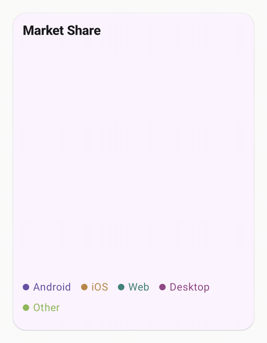
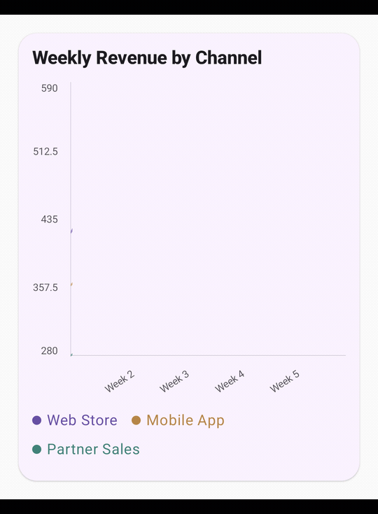

<h1 align="center">compose-gif-recorder</h1>

<p align="center">
  <a href="https://central.sonatype.com/artifact/io.github.hdcodedev/compose-gif-recorder-gradle-plugin">
    
  </a>
  
  
  
  
</p>

<p align="center">
  Deterministic GIF recording for Jetpack Compose.
</p>

## Motivation

This plugin was originally created to automate GIF generation
for the [Charts wiki documentation](https://charts.harisdautovic.com/2.2.0/wiki/examples).

Whenever chart styles, animations, or APIs change,
all documentation GIFs can be easily regenerated in an automated way.

## Requirements

- Android app module using Jetpack Compose
- Gradle plugins: Android application, Kotlin Compose, KSP
- Installed tools on `PATH`: `adb`, `ffmpeg`, `ffprobe`, `gifsicle`
- Running emulator or connected Android device

## Use In Your App

### 1. Apply plugins in your app module

Option A (recommended): use Version Catalog (`gradle/libs.versions.toml`)

```toml
[versions]
compose-gif-recorder = "<version>"

[plugins]
composeGifRecorder = { id = "io.github.hdcodedev.compose-gif-recorder", version.ref = "compose-gif-recorder" }
```

Then in your app module `build.gradle.kts`:

```kotlin
plugins {
    id("com.android.application")
    id("org.jetbrains.kotlin.plugin.compose")
    id("com.google.devtools.ksp")
    alias(libs.plugins.composeGifRecorder)
}
```

Option B: apply plugin directly

```kotlin
plugins {
    id("com.android.application")
    id("org.jetbrains.kotlin.plugin.compose")
    id("com.google.devtools.ksp")
    id("io.github.hdcodedev.compose-gif-recorder") version "<version>"
}
```

The plugin wires recorder dependencies automatically (`annotations`, `core`, `android`, `ksp`).

### 2. Configure the recorder

Add this in your **app module** `build.gradle.kts` file (the same file where you applied the plugin):

```kotlin
gifRecorder {
    applicationId.set("com.example.app")
    // Optional. Defaults to "artifacts/gifs" in the app module.
    outputDir.set(
        layout.projectDirectory.dir("artifacts/gifs"),
    )
}
```

### 3. How to use

#### 3.1 Simple

Pie chart with default recorder settings:

```kotlin
@RecordGif
@Composable
fun PieChartDemo() {
    // UI content
}
```

<p align="center">
  
</p>

#### 3.2 Advanced

Multi line chart with swipe interactions:

```kotlin
@RecordGif(
    name = "multi_line_custom_gesture",
    durationMs = 3200,
    interactionNodeTag = "LineChartPlot",
    interactions = [
        GifInteraction(
            type = GifInteractionType.SWIPE,
            target = GifInteractionTarget.CENTER,
            direction = GifSwipeDirection.LEFT_TO_RIGHT,
            distance = GifSwipeDistance.LONG,
            speed = GifSwipeSpeed.NORMAL,
            framesAfter = 12,
        ),
    ],
)
@Composable
fun MultiLineChartDemo() {
    // UI content
}
```

<p align="center">
  
</p>

### 4. Run tasks

List available scenarios:

```bash
./gradlew :app:listGifScenarios
```

Record one scenario:

```bash
./gradlew :app:recordGifDebug -PgifScenario=PieChartDemo
```

Record all scenarios:

```bash
./gradlew :app:recordGifsDebug
```

Generated GIFs are written to `app/artifacts/gifs` (or your configured `outputDir`).
If your application module is not named `app`, replace `:app:` in the commands.

## Common Configuration

You can override binaries/device selection when needed:

```kotlin
gifRecorder {
    adbSerial.set("emulator-5554") // default: auto
    adbBin.set("adb")
    ffmpegBin.set("ffmpeg")
    ffprobeBin.set("ffprobe")
    gifsicleBin.set("gifsicle")
}
```
